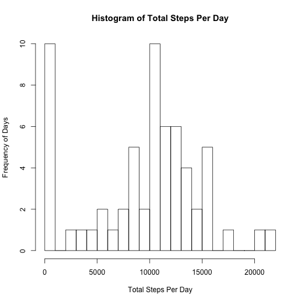
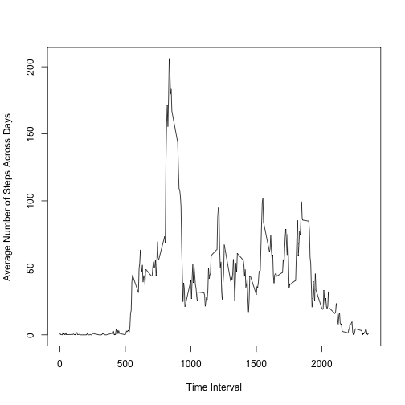
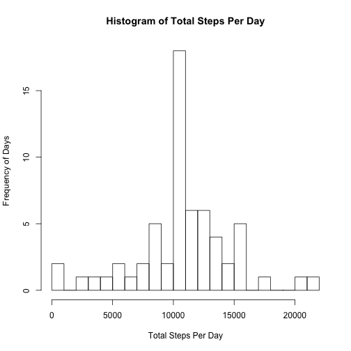
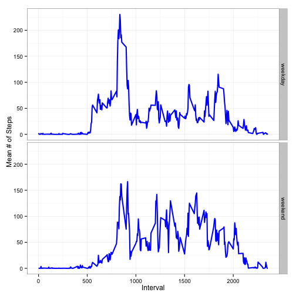

**Load and Preprocess the Data**

```r
options(scipen=999)
setwd("~/Desktop/Data Science Specialization/Reproducible Reseach/Assignment 1/RepData_PeerAssessment1")
file<-read.csv("activity.csv")
#date format is- y-m-d
file$date<-as.factor(file$date)
```
**What is the Mean Number of Total Steps Taken Per Day?**

```r
ss1<-file[, 1:2]
library(plyr)
#calculate sum of steps as a function of day (date)
sums<-ddply(ss1, .(date), numcolwise(sum, na.rm=TRUE))

#plot histogram of total steps each day
hist(sums$steps, xlab=("Total Steps Per Day"), ylab=("Frequency of Days"), breaks=20, main=("Histogram of Total Steps Per Day"))
```

 

```r
#calculate average steps per day
averageSteps<-mean(sums$steps)
averageSteps
```

```
## [1] 9354.23
```

```r
#calculate median steps per day
medianSteps<-median(sums$steps)
medianSteps
```

```
## [1] 10395
```
*The mean number of steps taken per day is 9354.23*
*The median number of steps taken per day is 10395*

**What is the Average Daily Activity Pattern?**

```r
#need average steps per 5-minute interval across days
#file$interval<-as.factor(file$interval)
intStepMeans<-ddply(file, .(interval), numcolwise(mean, na.rm=TRUE))
#create time series plot
timeSeries<-plot(intStepMeans$interval, intStepMeans$steps, type="l", xlab="Time Interval",
     ylab="Average Number of Steps Across Days")
```

 

```r
#display plot
timeSeries
```

```
## NULL
```

```r
#Which interval has the highest average steps
maxRow<-which.max(intStepMeans[, 2])
intStepMeans[maxRow, ]
```

```
##     interval    steps
## 104      835 206.1698
```
*The interval with the largest number of average steps is interval 835*

**Imputing Missing Values**

```r
#calculate total number of rows containing 'NA's'
NAdf<-subset(file, is.na(file$steps))
dims<-dim(NAdf)
NAnumber<-dims[1] #2304
#fill in missing values in dataset
#use averages in intStepMeans to fill in NA for each interval 
impDF<-file
#make list of indices for NA rows
nas<-which(is.na(impDF), arr.ind = TRUE)
nas_rows <- nas[,1]
days<-length(unique(impDF$date))
longMeans<-rep(intStepMeans$steps, days)
impDF$steps[nas_rows]<-longMeans[nas_rows]


library(dplyr)

sumsNew<-group_by(impDF, date) %>% summarise(totalSteps = sum(steps))
#plot histogram of total steps each day with imputed data

hist(sumsNew$totalSteps, xlab=("Total Steps Per Day"), ylab=("Frequency of Days"), breaks=20, main=("Histogram of Total Steps Per Day"))
```

 

```r
#calculate average steps per day
averageImpSteps<-mean(sumsNew$totalSteps)
averageImpSteps
```

```
## [1] 10766.19
```

```r
#calculate median steps per day
medianImpSteps<-median(sumsNew$totalSteps)
medianImpSteps
```

```
## [1] 10766.19
```

*The average number of steps is now 10766.19 per day*
*The medain number of steps is now 10766.19 per day*

These values do indeed differ from the first part of the assignment.By imputing the missing data (using the means for the intervals in question across all days), the estimates of the total number of dailly steps change because there are now much fewer days in which 'zero' steps are factored into the totals (as is evident by comparing the two histograms).

**Are there any differences in activity patterns between weekdays and weekends?**

```r
impDF$date<-as.Date(impDF$date)
weekdays<-weekdays(impDF$date)
DAY<-c()
i=1
while(i<=length(weekdays)){
        if(weekdays[i]=='Saturday'|weekdays[i]=='Sunday'){
                DAY<-c(DAY, 'weekend')
                }else{
                        DAY<-c(DAY, 'weekday')
                        }
        i<-i+1
        }
impDF<-cbind(impDF, DAY)
#get means steps per day
meanDays<-ddply(impDF, .(interval, DAY), numcolwise(mean, na.rm=TRUE))

#create time series plot
library(ggplot2)
ggplot(data=meanDays, aes(x = interval, y = steps, group=1))+
        geom_line(size=1, color='blue')+
        facet_grid(DAY~.)+ylab("Mean # of Steps") + 
        xlab("Interval") + theme_bw() 
```

 

